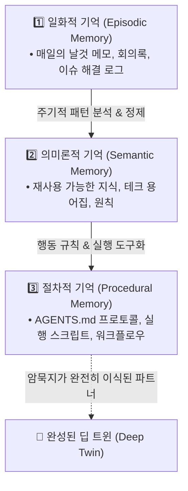

## 1. 최신 트렌드: '고정된 파이프라인'에서 '자율적 에이전트'로의 진화

과거의 인공지능 지식 관리는 인간이 스스로 자신의 노하우를 문서로 작성하여 시스템에 입력하는 방식이 주를 이루었습니다(전통적 지식 관리). 그러나 최근의 트렌드는 거대 언어 모델(LLM)이 데이터의 이면을 분석하여 인간조차 인지하지 못했던 패턴(암묵지)을 역으로 추출해 내는 방향으로 진화했습니다.

특히 시스템 구조 면에서 가장 큰 변화는 단순 검색 증강 생성([[rag|RAG]])의 한계를 극복한 **'에이전틱 AI(Agentic AI)'**의 부상입니다. 

| 구분 | 전통적 RAG | 에이전틱 RAG (Agentic RAG) |
| :--- | :--- | :--- |
| **작동 방식** | `검색 ➡️ 생성 (Retrieve-then-generate)` 고정 파이프라인 | `동적 추론 시스템 (Dynamic reasoning system)` |
| **의사결정 주체** | 고정된 코드 흐름 (정적 쿼리) | 에이전트의 추론 및 오케스트레이션 레이어 |
| **정보 부족 시** | 검색 결과가 나쁘면 그대로 부정확한 답변 생성 | 스스로 재검색, 쿼리 재작성, 다른 도구 호출 |
| **실행 흐름** | 단방향 파이프라인 (Linear) | 목표 달성 시까지 루프 및 분기 수행 (Iterative) |

---

## 2. 추구해야 할 방향: '지식 자본화'와 진정한 '플러스 휴먼'

iOS 네이티브 개발자에서 프로덕트 엔지니어(PE, Product Engineer)로 전환하며 살아남기 위해서는 단순한 '업무 자동화'가 아닌 **'지식 자본(Knowledge Capital)'**의 축적을 목표로 해야 합니다. 여기서 PE는 이 볼트 전체에서 Product Engineer를 뜻합니다.

### ① '그릇(Vessel)'으로의 직무 이동
* 데이터 취합이나 단순 문서 작업(Template 영역)은 가장 빠르게 AI로 대체됩니다.
* 실무자는 결과물이 아니라 **"왜 이 시점에 신 아키텍처 전환 대신 브라운필드 통합을 택했는가?"**, **"왜 이 기능은 피처 플래그 뒤에 숨겨 배포했는가?"**와 같은 **상황적 맥락(Context)**과 이해관계 조율 등, AI가 모방하기 힘든 '그릇'의 역할에 집중해야 합니다.

### ② 인간과 AI의 코티밍 (Co-teaming)
* 일방적으로 AI에게 프롬프트 지시를 내리는 수준을 넘어서야 합니다.
* 자신의 암묵지(제약 조건, 리스크 허용 범위, 우선순위 판단 기준)를 AI에게 지속적으로 주입하여 나의 의사결정 방식을 모방하게 만드는 **'개인 견습생(Apprentice)'** 훈련 모델을 구축해야 합니다.

---

## 3. 개인/사내 구축용 로컬 AI 도구 스택

노션(Notion)이나 외부 상용 SaaS 의존도를 낮추고, 보안과 데이터 주권을 지키며 나만의 완벽한 '제2의 뇌'를 로컬/독립 환경에 구축하기 위한 최적의 도구 스택입니다:

```
[ 🎙️ Capture: 날것의 대화 & 회의록 ]
   └─ Otter.ai, Clova Note (실시간 음성 추론 텍스트화)
           │
           ▼
[ 📁 Storage & Vector DB: 로컬 데이터베이스 ]
   ├─ 로컬 마크다운 (.md) 파일 (Obsidian Vault)
   └─ 로컬 벡터 데이터베이스 (ChromaDB, Qdrant)
           │
           ▼
[ 🧠 Orchestration: 동적 추론 레이어 ]
   └─ LangGraph (상태 기반) OR LlamaIndex Workflows (이벤트 기반)
           │
           ▼
[ 🎯 Deep Twin: 지식 자본화 및 실무 파트너 ]
```

1. **수집 도구 (Capture):** Otter.ai, Clova Note 등 음성 인식 AI를 활용해 회의나 실무 중 발생하는 날것의 대화(Live reasoning)를 텍스트로 즉각 변환합니다.
2. **저장 및 검색 데이터베이스 (Storage & Retrieval):** 텍스트(`.md`) 파일 형태로 로컬 폴더에 보관하고, 이를 의미론적으로 검색할 수 있도록 로컬 벡터 DB(ChromaDB, Qdrant 등)에 임베딩하여 격리 보관합니다.
3. **오케스트레이션 프레임워크 (Orchestrator):** 에이전트가 위 데이터베이스를 스스로 뒤져 논리를 전개하게 만드는 뼈대로 LangGraph 또는 LlamaIndex Workflows를 채택합니다.

---

## 4. 구현 방식: 에이전틱 오케스트레이션 설계 비교

AI가 고정된 순서 없이 스스로 도구를 선택하고 반복 학습하며 데이터를 찾아오게 만드는 오케스트레이터의 구현은 성격에 따라 두 가지 프레임워크로 나뉩니다.

```mermaid
flowchart LR
    subgraph LangGraph["LangGraph (상태 그래프)"]
        direction TB
        S[State] --> N1[Node 1]
        N1 --> C{Conditional Edge}
        C -- 루프/재시도 --> N1
        C -- 승인 대기 --> HITL[Human-in-the-Loop]
        HITL --> N2[Node 2]
    end

    subgraph LlamaIndex["LlamaIndex Workflows (이벤트 비동기)"]
        direction TB
        E1[Event A] --> Step1[@step Step 1]
        Step1 --> E2[Event B: Pydantic]
        E2 --> Step2[@step Step 2]
        E2 --> Step3[@step Step 3 (병렬 검색)]
    end
```

### 방향 A: LangGraph (상태 기반 그래프 구조)
LangChain 생태계에서 에이전틱 워크플로우를 구축하기 위한 핵심 프레임워크입니다.
* **핵심 구조:** 시스템의 현재 상황을 기억하는 **'상태(State)'**, 실제 연산을 수행하는 **'노드(Nodes)'**, 다음 단계를 동적으로 결정하는 **'조건부 엣지(Conditional Edges)'**로 구성됩니다.
* **특장점:**
  * 반복 루프(Loop)를 네이티브하게 지원합니다.
  * 에이전트가 작업을 멈추고 인간의 승인을 기다리게 하거나 과거 상태로 되돌리는 **체크포인팅(Checkpointing / HITL)** 기능이 매우 강력합니다.
  * 중앙 통제형(Supervisor)이나 자율 분산형(Swarm) 등 다양한 조직도 아키텍처를 유연하게 구성할 수 있습니다.

### 방향 B: LlamaIndex Workflows (이벤트 기반 비동기 구조)
데이터 집약적인 작업과 고도화된 문서 검색(RAG)에 가장 강력한 프레임워크입니다.
* **핵심 구조:** 데이터를 실어 나르는 **'이벤트(Events, Pydantic 모델)'**와, 특정 이벤트를 구독하여 실행되는 비동기 함수인 **'단계(Steps, `@step` 데코레이터 사용)'**로 이루어집니다.
* **특장점:**
  * 방대한 이종 데이터 소스(문서, DB, 웹 등)와의 결합이 매우 직관적입니다.
  * 각 단계가 이벤트를 매개로 비동기 연결되므로, 유연한 분기 처리와 동시 병렬 검색(Parallel Retrieval)을 코드 몇 줄로 손쉽게 구현할 수 있습니다.

---

## 5. 핵심 구현 목표: '기억의 통합(Memory Consolidation)'

위 프레임워크를 이용해 최종적으로 코딩해야 하는 궁극의 파이프라인은 **단편적인 일상의 메모를 '실무적 원칙'으로 승화시키는 것**입니다.

에이전트가 다단계 장기 작업(Long-horizon task)을 일관되게 수행하려면 신뢰할 수 있는 3단 메모리 구조가 필수적입니다:



1. **일화적 기억 (Episodic Memory):** 로컬에 매일 쌓이는 단편적인 메모, 에러 로그, 날것의 회의 기록입니다.
2. **의미론적 기억 (Semantic Memory):** 시스템이 주기적으로 일화적 기억들을 읽어 들여, 반복되는 패턴과 성공/실패 요인을 식별한 뒤 재사용 가능한 지식과 멘탈 모델로 변환(Consolidation)합니다.
3. **절차적 기억 (Procedural Memory):** 축적된 원칙을 바탕으로 시스템이 "어떻게 작업을 수행해야 하는지" 구체적인 행동 규칙(`AGENTS.md`, 자동화 툴)을 갖추게 됩니다.

이 사이클이 완성될 때, 에이전트는 단순한 챗봇이 아니라 **나의 암묵지가 이식된 프로덕트 엔지니어링 파트너**로 작동하게 됩니다.

---

## 🔗 연관 지식 & 위키
- [[multi-agent-orchestration]]: Orca 기반 멀티 에이전트 실전 파이프라인
- [[agentic-rag|Agentic RAG (에이전틱 RAG)]]: 고정 파이프라인을 넘어서는 동적 추론 레이어
- [[memory-consolidation|Memory Consolidation (기억의 통합)]]: 3단 에이전트 메모리 승격 메커니즘
- [[index-moc|지식 지도 MOC]]
